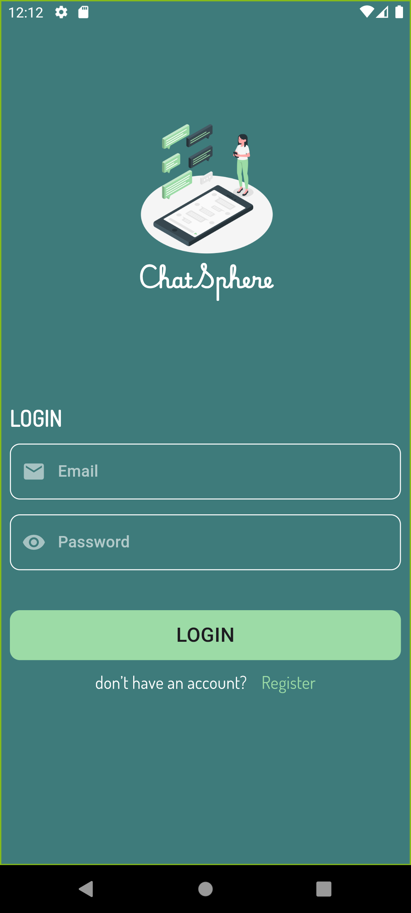

# 💬 ChatSphere

**A Real-Time Messaging App Built with Flutter**

ChatSphere is a modern chat application that enables users to communicate instantly through real-time messaging.  
The app provides a secure authentication system and a smooth chat experience using **Firebase services** and **Cubit for state management**.

---

## 🎥 App Demo

  

Click the image above to watch the full demo video.

---

## ✨ Features

- 🔐 **Authentication System**
  - Sign Up
  - Login
  - Secure authentication using **Firebase Authentication**

- 💬 **Real-Time Messaging**
  - Send and receive messages instantly
  - Messages synced in real-time using **Firebase Firestore**

- ⚡ **Smooth User Experience**
  - Clean and responsive chat interface

- 🧠 **State Management**
  - Implemented using **Cubit (Bloc)**

---

## 🛠 Tech Stack

| Technology | Usage |
|------------|-------|
| Flutter | Cross-platform mobile development |
| Firebase Authentication | User authentication |
| Firebase Firestore | Real-time message storage |
| Cubit (Bloc) | State management |
| Dart | Programming language |

---

## 🎯 Project Goals

- Build a **real-time messaging application**
- Implement **Firebase Authentication & Firestore**
- Use **Cubit for scalable state management**

